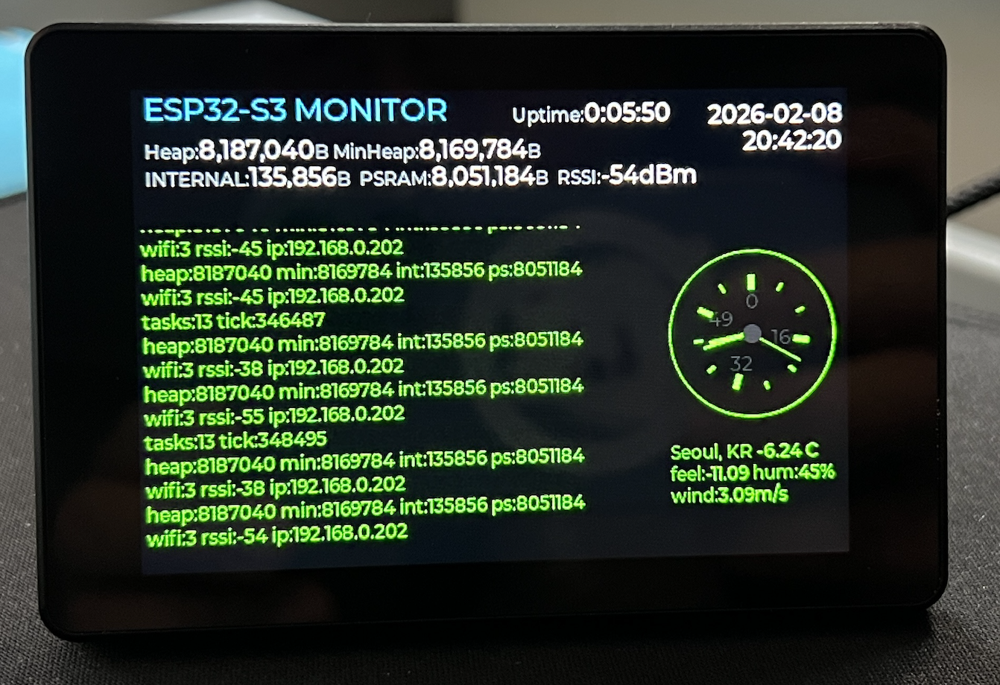

# 📟 ESP32 Log Viewer (Real-Time System Monitor)

ESP32-S3의 모든 시스템 로그(ESP_LOG) 및 시리얼 출력을 3.5인치 LCD 화면에 **실시간 터미널** 형태로 보여주는 프로젝트입니다.
`Serial.print` 뿐만 아니라 ESP-IDF 내부의 운영체제 로그까지 모두 화면에 출력됩니다.



## ✨ 주요 기능 (Key Features)

### 1. 실시간 로그 리다이렉션 (Log Redirection)

- `esp_log_set_vprintf` API를 활용하여 ESP32의 표준 입출력을 가로채 LCD로 전달합니다.
- 부팅 과정, Wi-Fi 연결 상태, 메모리 할당 등 시스템 깊숙한 곳의 정보를 눈으로 직접 확인할 수 있습니다.

### 2. 해커 스타일 터미널 UI

- **Dark Mode**: 눈이 편안한 리얼 블랙 배경(0x000000).
- **Matrix Green Text**: 가독성이 뛰어난 형광 초록 폰트(0x00FF00) 적용.
- **Auto Scroll**: 새로운 로그가 도착하면 자동으로 화면 최하단으로 스크롤됩니다.

### 3. 고성능 시스템 모니터링

- **0.5초 갱신 주기**: 500ms마다 시스템 상태를 갱신하여 멈춰있는 느낌 없이 생생한 모니터링이 가능합니다.
- **메모리 분석**:
  - `Heap`: 실시간 가용 힙 메모리
  - `Internal / PSRAM`: 내부 SRAM과 외부 PSRAM의 사용량을 분리하여 정밀 추적.

### 4. 안정성 확보 (Stability)

- **Ring Buffer Protection**: 로그 텍스트가 10,000자를 초과하면 자동으로 오래된 로그를 정리하여 메모리 오버플로우를 방지합니다.
- **Thread Safety**: LVGL UI 업데이트 시 Mutex Lock을 사용하여 충돌 없는 안전한 렌더링을 보장합니다.

---

## 🛠️ 하드웨어 구성 (Hardware)

- **MCU**: ESP32-S3 (QSPI Interface supported)
- **Display**: 3.5" SPI/QSPI LCD (480x320 Resolution)
- **Driver Info**:
  - Controller: `AXS15231B`
  - Interface: QSPI (Quad SPI)

---

## 🚀 사용 방법 (How to Use)

### 1. 필수 라이브러리 설치

이 프로젝트는 **LVGL** 그래픽 라이브러리에 의존성을 가집니다.

- `lvgl` (v8.3.x 권장)

### 2. 컴파일 및 업로드 (CLI)

Arduino CLI를 사용하여 터미널에서 바로 빌드하고 업로드할 수 있습니다.

**컴파일 (Compile):**

```bash
arduino-cli compile --fqbn esp32:esp32:esp32s3:CDCOnBoot=cdc,FlashSize=16M,PartitionScheme=app3M_fat9M_16MB,PSRAM=opi .
```

**업로드 (Upload):**

> 포트(`/dev/cu.usbmodem...`)는 본인의 환경에 맞게 변경하세요.

```bash
arduino-cli upload -p /dev/cu.usbmodem2101 --fqbn esp32:esp32:esp32s3:CDCOnBoot=cdc,FlashSize=16M,PartitionScheme=app3M_fat9M_16MB,PSRAM=opi .
```

---

## 📝 개발자 노트 (Dev Notes)

### 로그 리다이렉션 핵심 코드

```cpp
// ESP_LOG의 내용을 가로채서 LVGL 텍스트 영역에 추가하는 함수
extern "C" int vprintf_to_lvgl(const char *format, va_list args) {
    // ... (중략) ...
    if (bsp_display_lock(50)) { // UI 충돌 방지 락
        lv_textarea_add_text(log_ta, buf);
        bsp_display_unlock();
    }
    return vprintf(format, args); // 시리얼 출력도 유지
}
```

## 📜 라이선스

Apache-2.0
