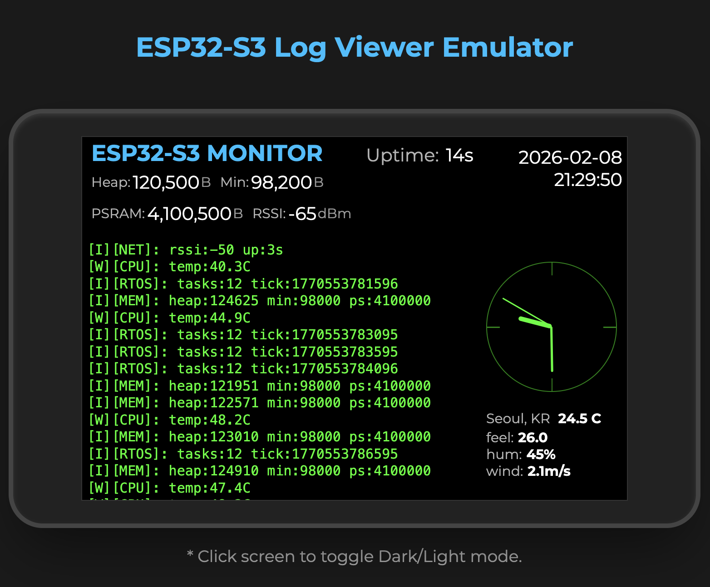
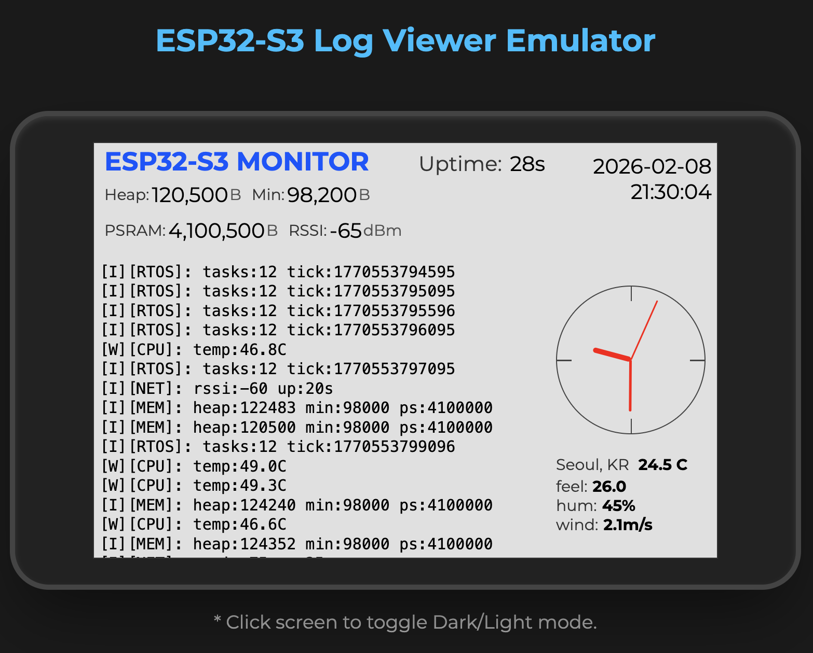
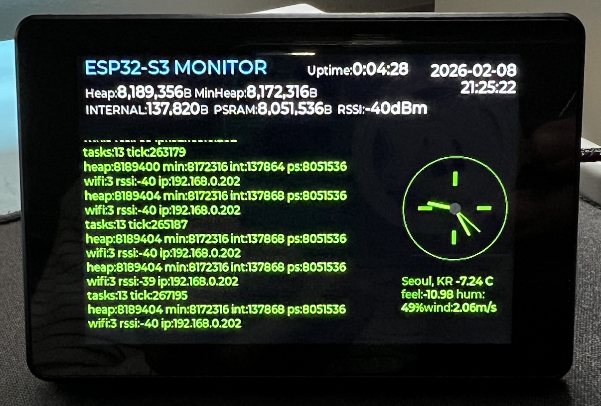

# 📟 ESP32 Log Viewer (Real-Time System Monitor)

ESP32-S3의 모든 시스템 로그(ESP_LOG) 및 시리얼 출력을 3.5인치 QSPI LCD 화면에 **실시간 터미널** 형태로 보여주는 고성능 모니터링 프로젝트입니다.
**화면을 터치하면 다크 모드와 라이트 모드가 전환됩니다.**





## ✨ 주요 기능 (Key Features)

### 1. 🖥️ 실시간 로그 리다이렉션 (Real-time Log Redirection)

- **ESP_LOG Hook**: `esp_log_set_vprintf` API를 활용하여 ESP32의 표준 입출력을 가로채 LCD로 전달합니다.
- **Terminal UI**: 시스템 로그가 링 버퍼에 저장되어 자동으로 스크롤되며 표시됩니다.
- **Auto Scroll**: 새로운 로그 수신 시 화면 최하단으로 자동 이동.

### 2. 🎨 터치 테마 전환 (Touch Theme Switching)

- **Dark Mode**: 해커 스타일의 리얼 블랙(0x000000) 배경 + 형광 녹색 텍스트.
- **Light Mode**: 깔끔한 화이트(0xE0E0E0) 배경 + 다크 그레이 텍스트.
- **Interaction**: 화면의 **아무 곳이나 터치**하면 즉시 테마가 전환됩니다.
- **Dynamic Styling**: 시계 바늘, 테두리, 텍스트 색상이 테마에 맞춰 실시간으로 변경됩니다.

### 3. ⏱️ 고정밀 아날로그 시계 (Precision Analog Clock)

- **Smooth Movement**: 시침 위치를 분 단위로 정밀하게 계산하여(0~600 resolution) 부드러운 움직임을 구현했습니다.
- **Minimalist Design**: 숫자와 자잘한 눈금을 제거하고 12, 3, 6, 9시 방향의 포인트만 강조한 모던한 디자인.
- **Dimmed Style**: 눈부심 방지를 위해 시계 테두리와 눈금 밝기를 50%로 조정.

### 4. 📊 시스템 및 환경 정보

- **Memory**: Heap, MinHeap, PSRAM 사용량을 실시간 모니터링.
- **Network**: Wi-Fi RSSI 신호 강도 표시.
- **Environment**: OpenWeatherMap API를 연동하여 서울의 실시간 날씨(기온, 체감온도, 습도, 풍속) 표시.

---

## 🛠️ 하드웨어 구성 (Hardware Spec)

이 프로젝트는 **ESP32-S3**의 고속 **QSPI (Quad SPI)** 인터페이스를 사용하여 480x320 해상도를 부드럽게 구동합니다.

| Component      | Specification | Description                             |
| -------------- | ------------- | --------------------------------------- |
| **MCU**        | ESP32-S3      | Dual-core, WiFi/BLE, AI Instruction     |
| **Flash**      | 16MB          | Large storage for app code & assets     |
| **PSRAM**      | 8MB (OPI)     | Octal SPI RAM for LVGL buffer & logging |
| **Display**    | 3.5" IPS LCD  | 480x320 Resolution                      |
| **Controller** | AXS15231B     | QSPI Interface Supported                |
| **Touch**      | GT911         | I2C Capacitive Touch                    |

---

## ⚙️ 설정 방법 (Configuration)

`54-4_ESP32-LogViewer.ino` 파일 상단의 설정을 본인의 환경에 맞게 수정하세요.

```cpp
// Wi-Fi 설정
const char* ssid     = "YOUR_WIFI_SSID";
const char* password = "YOUR_WIFI_PASSWORD";

// 날씨 API 설정 (OpenWeatherMap)
const char* OWM_KEY = "YOUR_API_KEY"; // https://openweathermap.org/api

// 시간대 설정 (한국: UTC+9 = 3600 * 9)
const long  gmtOffset_sec = 3600 * 9;
```

---

## 🚀 빌드 및 업로드 (Build & Upload)

### 1. Arduino CLI (권장)

터미널에서 직접 빌드하고 업로드하는 것이 가장 빠르고 정확합니다.

**컴파일 (Compile):**

```bash
arduino-cli compile --fqbn esp32:esp32:esp32s3:CDCOnBoot=cdc,FlashSize=16M,PartitionScheme=app3M_fat9M_16MB,PSRAM=opi .
```

**업로드 (Upload):**
_(포트명 `/dev/cu.usbmodem...`은 본인의 환경에 맞게 변경하세요)_

```bash
arduino-cli upload -p /dev/cu.usbmodem2101 --fqbn esp32:esp32:esp32s3:CDCOnBoot=cdc,FlashSize=16M,PartitionScheme=app3M_fat9M_16MB,PSRAM=opi .
```

---

## 📝 개발자 노트 (Dev Notes)

### 동적 테마 구현

LVGL 객체(Meter 등)의 스타일을 런타임에 변경하기 위해, 테마 전환 시 시계 객체(`clock_meter`)를 삭제하고 재생성(`create_clock_meter`)하는 방식을 사용했습니다. 이는 `Needle`과 같은 내부 구성 요소의 색상을 동적으로 바꾸는 가장 확실한 방법입니다.

### 로그 리다이렉션

`esp_log_set_vprintf` 함수를 사용하여 시스템 레벨 로그를 가로채고, FreeRTOS Queue를 통해 UI 스레드로 안전하게 전달합니다.

---

## 📜 라이선스 (License)

Apache-2.0 License
